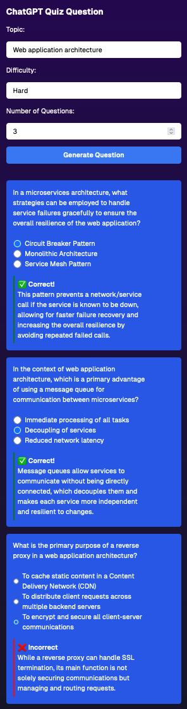

# Gentle Quiz app

- I want to be able to test myself on mainstream and esoteric topics, but I also want to learn from any mistakes (or guesses that just happened to be right), so I want explanations given.
- I can have that with UI / chat version of ChatGPT, but either it's incredibly slow (if going one at a time) or I can see the explanation _while_ trying to take the test - plus the UI for answering is writing the letter. Eeks.
- Here's a thin wrapper around question generation

## Future plans

- Would be neat to make this a social experience. Users can use their own paid ChatGPT API key to generate high quality questions (and those could get stored to Prisma db and then people that don't have paid ChatGPT can take other people's quizzes)
- Bigger issue than getting users would be costs with scaling, so dog fooding the "just me" version for a while first to see if this is worth working on more.

If you end up testing it locally, please let [me](https://www.linkedin.com/in/julian-sloman/) know how it goes! - Feel free to contribute Pull Requests or discussion.

## Current example

---

## Create a T3 app yourself

Run `create-t3-app` - see [getting started](https://github.com/t3-oss/create-t3-app?tab=readme-ov-file#getting-started)

Respective docs for tech used.

- [Next.js](https://nextjs.org)
- [NextAuth.js](https://next-auth.js.org)
- [Prisma](https://prisma.io)
- [Drizzle](https://orm.drizzle.team)
- [Tailwind CSS](https://tailwindcss.com)
- [tRPC](https://trpc.io)

Also helpful: [Discord](https://t3.gg/discord)

### More about T3

- [T3 Stack Documentation](https://create.t3.gg/)
- [Learn the T3 Stack](https://create.t3.gg/en/faq#what-learning-resources-are-currently-available) — Check out these awesome tutorials

You can check out the [create-t3-app GitHub repository](https://github.com/t3-oss/create-t3-app) — your feedback and contributions are welcome!

### How do I deploy this?

Deployment guides for [Vercel](https://create.t3.gg/en/deployment/vercel), [Netlify](https://create.t3.gg/en/deployment/netlify) and [Docker](https://create.t3.gg/en/deployment/docker)
